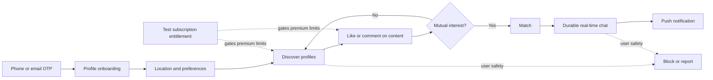
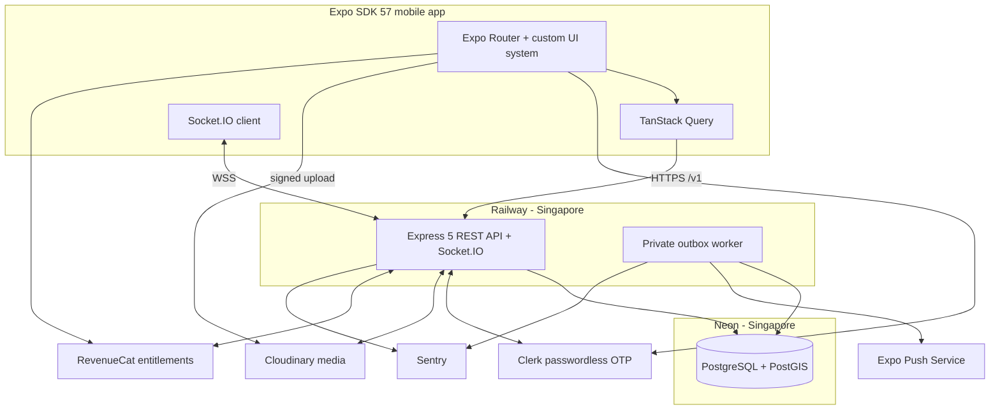

# ProDate

### A production-shaped, Hinge-inspired dating application built as an end-to-end mobile engineering project

`ProDate` is an independent portfolio and learning project that recreates the core mechanics of a modern dating application with original branding, interaction design, and implementation. The goal is not a public launch; the goal is to build the complete system as close to a real product as practical: passwordless verification, profile creation, geospatial discovery, item-specific likes and comments, mutual matches, durable real-time messaging, push notifications, safety controls, test-store subscriptions, observability, and repeatable deployment.

> **Project status:** authentication, profile onboarding, nearby discovery, and item-specific engagement are implemented end to end. Members can publish a profile with four to six photos and three curated prompt answers, browse full profiles, like a particular photo or prompt with an optional opening comment, and merge or decline incoming pull requests. A merge creates a durable connection; pass, block, and report actions are persisted by the API. The Expo app, Express API, shared Zod contracts, Drizzle repositories, and Neon/PostGIS queries are covered by 309 automated tests plus a rollback-only live database integration check. Email OTP is the current development path while India SMS enablement is pending with Clerk support. The new discovery flow awaits physical-iPhone acceptance. Messaging, push delivery, complete App Review safety operations, account lifecycle controls, and subscriptions remain in development.

## Product preview

Verified screenshots will be added after each workflow runs on the physical iPhone test path. They will use fictional seed profiles and redact phone numbers, exact locations, tokens, and other private data. Concept mockups will never be presented as implemented product evidence.

The planned gallery will cover:

| Authentication     | Onboarding          | Discovery        | Engagement       |
| ------------------ | ------------------- | ---------------- | ---------------- |
| Phone or email OTP | Profile and prompts | Profile card     | Like or comment  |
| Match              | Messaging           | Safety           | Subscription     |
| Match celebration  | Durable chat        | Block and report | Test entitlement |

## What this project demonstrates

- A complete mobile journey from passwordless OTP through matching and messaging
- A custom, accessible Expo interface rather than a generic component-library skin
- Fully relational dating-domain modeling with PostgreSQL and PostGIS
- Privacy-aware proximity filtering without exposing exact coordinates
- Retry-safe mutations, canonical match creation, durable messages, and webhook idempotency
- Real-time delivery through Socket.IO with PostgreSQL as the source of truth
- Asynchronous push delivery through a transactional outbox and worker
- Mobile subscription entitlements through RevenueCat's test environment
- A beginner-readable physical-iPhone workflow that starts in Expo Go and graduates to an EAS development build
- Production-oriented validation, authorization, rate limiting, logging, error reporting, automated tests, and deployments

## Core user workflow



## Release scope

“V0” is deliberately a thin but complete product loop. Later versions deepen the product only after that loop is reliable.

| Area          | V0                                                                  | V1                                                       | V2                                                      |
| ------------- | ------------------------------------------------------------------- | -------------------------------------------------------- | ------------------------------------------------------- |
| Identity      | Clerk phone/email OTP, internal account, server-enforced 18+ rule   | Account recovery and richer lifecycle controls           | Optional stronger age/identity assurance                |
| Profiles      | Attributes, prompts, photos, ordering, completeness                 | More prompt/media formats and profile editing depth      | Voice/video prompts and experiments                     |
| Discovery     | Distance and preference filtering, baseline ordering, pagination    | Richer filters, undo, improved candidate balancing       | Learned ranking, standouts, explainable recommendations |
| Engagement    | Item-specific likes/comments, passes, mutual match                  | Incoming-like improvements and richer match feedback     | Roses, boosts, and consumable mechanics                 |
| Messaging     | Persisted text messages, Socket.IO delivery, reconciliation         | Reactions, typing/read indicators, richer inbox controls | Voice notes and advanced conversation assistance        |
| Safety        | Block, unmatch, report, evidence preservation, privacy controls     | Moderation operations and proactive interaction nudges   | Verification signals and risk-assisted review           |
| Notifications | Match/message push with preferences and receipts                    | Granular notification settings and reminders             | Personalized notification timing                        |
| Monetization  | RevenueCat Test Store entitlement                                   | App Store / Play Billing sandbox products                | Multiple tiers and consumables                          |
| Operations    | Health checks, logs, Sentry, rate limits, backups/deploy discipline | Operational dashboards and stronger runbooks             | Scale testing and multi-replica realtime infrastructure |

Not in V0: an admin moderation dashboard, identity verification, advanced recommendation models, boosts or roses, voice/video prompts, voice/video calling, social login, general email/SMS messaging, multi-region infrastructure, Kubernetes, microservices, Elasticsearch, or a public App Store launch.

## Experience and visual direction

The interface will be original—not a traced or pixel-identical Hinge UI.

| Area          | Direction                                                                                                         |
| ------------- | ----------------------------------------------------------------------------------------------------------------- |
| Character     | Warm, editorial, calm, intentional, inclusive                                                                     |
| Palette       | Off-white canvas, white surfaces, near-black text, coral primary accent, deep-plum secondary accent               |
| Typography    | Manrope with a readable system-font fallback                                                                      |
| Shape         | Tactile cards, 16–24 px surface radii, restrained elevation, generous touch targets                               |
| Rhythm        | 8-point layout grid with optical 4-point adjustments                                                              |
| Motion        | Purposeful 180–260 ms transitions, restrained springs, contextual haptics                                         |
| Accessibility | Dynamic type, VoiceOver labels, WCAG AA contrast, reduced motion, 44-point minimum targets, non-color-only states |
| Theme         | Light V0 theme with semantic tokens ready for a future dark theme                                                 |

The initial internal component set includes `AppText`, `Button`, `IconButton`, `TextField`, `PhoneField`, `OtpField`, `Avatar`, `Badge`, `PhotoTile`, `PromptCard`, `ProfileCard`, `BottomSheet`, `ProgressBar`, `Screen`, `EmptyState`, `ErrorState`, `OfflineBanner`, `Toast`, and `Skeleton`.

ProDate is tech-native, not tech-exclusive. Developer and startup language gives key interaction states a distinctive voice, while authentication, personal questions, consent, safety, and payment language remains direct. A first-use explanation always accompanies a branded term.

| Familiar action       | ProDate language | First-use meaning                     |
| --------------------- | ---------------- | ------------------------------------- |
| Send a like or reply  | Open a PR        | Send a thoughtful like or response    |
| Review incoming likes | Review PR        | See who wants to connect              |
| Mutual match          | Merged           | You matched and can start a thread    |
| Pass                  | Pass             | Kept neutral rather than “rejected”   |
| Safety actions        | Block / report   | Never renamed or softened with jargon |

## System architecture



The backend is a modular monolith deployed as two processes from one codebase: a public API/realtime service and a private worker. PostgreSQL is the only durable application datastore. External providers are isolated behind adapters so domain logic is not coupled to Clerk, Cloudinary, RevenueCat, Expo Push, or Sentry.

## Architecture decision register

| Decision          | Choice                                                                            | Why                                                                                    |
| ----------------- | --------------------------------------------------------------------------------- | -------------------------------------------------------------------------------------- |
| Mobile runtime    | [Expo SDK 57](https://expo.dev/changelog/sdk-57), React Native 0.86, React 19.2.3 | Current stable Expo line and supported by the current iOS Expo Go application          |
| Navigation        | Expo Router                                                                       | Expo-first routing, deep links, and typed route support                                |
| UI foundation     | React Native primitives, `StyleSheet`, typed tokens, internal components          | Distinctive product experience without a generic Material-style visual system          |
| Birthday input    | Expo UI SwiftUI/Compose `DateTimePicker`                                          | Native, accessible date selection included in Expo Go for SDK 57                       |
| Height input      | Expo UI universal `Picker`                                                        | Native wheel control on iOS with a cross-platform SDK 57 API                           |
| Device location   | Expo Location, foreground permission only                                         | Expo Go-compatible capture with an explicit privacy explanation and recoverable denial |
| API               | Express 5 REST under `/v1`                                                        | Explicit, versionable, testable mobile contracts                                       |
| Realtime          | Socket.IO                                                                         | Reconnect-friendly transport; durable state remains in PostgreSQL                      |
| Database          | Neon PostgreSQL with PostGIS in Singapore                                         | Relational integrity, transactions, and geospatial filtering near the backend region   |
| Data access       | Drizzle ORM and committed Drizzle Kit migrations                                  | Type-safe relational access and auditable schema history                               |
| Geospatial access | `geography(Point, 4326)` plus reviewed parameterized SQL where required           | Correct distance semantics without forcing all queries outside the ORM                 |
| Domain modeling   | Normalized relational tables; no JSONB domain documents                           | Explicit constraints, joins, uniqueness, and queryable relationships                   |
| Authentication    | Clerk custom phone/email OTP plus internal UUID users                             | Provider handles verification; application retains domain identity ownership           |
| Media             | Signed Cloudinary uploads                                                         | The device uploads directly without receiving a provider secret                        |
| Async work        | PostgreSQL transactional outbox and private worker                                | Couples state changes and side-effect intent atomically                                |
| Subscriptions     | RevenueCat Test Store, then platform billing sandboxes                            | Production-shaped entitlement handling without collecting card details directly        |
| Deployment        | Railway API/worker and Neon database in Singapore                                 | Simple first deployment with Docker, WebSockets, private services, and nearby data     |
| Scale posture     | One API replica and no Redis in V0                                                | Avoids infrastructure without a demonstrated scaling need                              |

## Technology stack

Exact package versions are pinned in the workspace lockfile. Expo-native versions are checked against Expo SDK 57 with Expo CLI and Expo Doctor rather than inferred from semver alone.

| Layer              | Technologies                                                                                                                                                                            |
| ------------------ | --------------------------------------------------------------------------------------------------------------------------------------------------------------------------------------- |
| Workspace          | Node.js 24 LTS, TypeScript 6 strict mode, pnpm 12 workspaces                                                                                                                            |
| Mobile             | Expo 57, React Native 0.86, React 19.2.3, Expo Router                                                                                                                                   |
| Mobile UI          | React Native `StyleSheet`, Expo UI DateTimePicker/Picker, Expo Location, Expo Image, Expo Image Picker, Expo Image Manipulator, Reanimated, Gesture Handler, Safe Area Context, Manrope |
| Mobile state/forms | TanStack Query, React Hook Form, Zod, React state first; Zustand only if a real cross-screen need appears                                                                               |
| API                | Express 5, Zod, Helmet, CORS, rate limiting, Pino, generated OpenAPI 3.1 with a protected Scalar reference                                                                              |
| Data               | PostgreSQL, PostGIS, Drizzle ORM, Drizzle Kit, `pg`, Neon                                                                                                                               |
| Integrations       | Clerk, Cloudinary, Socket.IO, Expo Notifications/Push, RevenueCat, Sentry                                                                                                               |
| Mobile tests       | Jest, `jest-expo`, React Native Testing Library, Maestro                                                                                                                                |
| API tests          | Vitest, Supertest, Testcontainers with real PostGIS                                                                                                                                     |
| Delivery           | Docker, Railway, Neon, EAS Build/Update, GitHub Actions                                                                                                                                 |

Intentionally deferred: Redis, the Socket.IO Redis adapter, Kubernetes, microservices, Elasticsearch, a large third-party UI kit, and speculative global-state infrastructure.

## Domain and data model highlights

- Every user has an internal UUID. Clerk subject IDs are unique external references, not primary domain identifiers.
- Profile birthdays are stored as normalized PostgreSQL `date` values rather than timestamps or JSON, preventing timezone drift in age calculations.
- Identity and pronouns are bounded text rather than closed database enums, allowing inclusive self-description while retaining separate visibility controls.
- Dating audiences use a constrained PostgreSQL text array, and relationship intent uses a finite transport contract suitable for filtering.
- Height is stored canonically in centimeters and rendered in both metric and imperial units on the device.
- Profile presentation is an ordered sequence of relational content items. Photo and prompt-answer tables specialize those items.
- A like references the exact profile content item that received the like or comment.
- A match stores a canonical low/high user pair protected by a unique constraint, preventing two concurrent likes from creating duplicate matches.
- A message carries a client-generated intent ID protected by a sender-scoped unique constraint, making mobile retries safe.
- Candidate and message lists use opaque cursor pagination rather than page numbers.
- Provider webhook event IDs are unique, and webhook payloads are normalized into typed relational fields.
- Latest location is stored as PostGIS geography. Exact coordinates are never returned to another user or included in logs.
- Domain transactions write outbox records atomically; the worker delivers push notifications and other external effects with retry and receipt handling.

## API and realtime contract

- REST is authoritative for bootstrap, profiles, discovery, likes, matches, history, safety actions, and reconciliation.
- Socket.IO delivers low-latency events but does not define durable truth.
- Every error uses one structured envelope with a machine code, safe message, optional validation details, and request ID.
- Boundary inputs, environment variables, webhooks, and third-party responses are validated with Zod.
- Retriable mutations use a client intent key whose payload is guarded by a database uniqueness constraint and request hash.
- List responses use stable opaque cursors.
- Reconnect flows fetch durable state so missed, duplicated, or out-of-order realtime events converge correctly.

Generated OpenAPI documentation will be exposed from the running API once endpoints exist; a separate public specification document is intentionally not kept in the repository.

## Safety, security, and privacy

- V0 requires a calendar birthday and enforces 18+ eligibility at the API boundary, but does not claim government-ID or selfie verification.
- Block and report are available from discovery and conversation contexts. Blocking removes mutual visibility and prevents new interaction.
- Reports preserve the minimum evidence needed for later review. V0 has no admin dashboard, so reporting must never imply an immediate human response that does not exist.
- Image uploads use constrained signed parameters, MIME/content validation, size limits, metadata removal, and derived delivery assets.
- Exact coordinates, phone numbers, session tokens, private message bodies, and provider secrets are excluded from logs and error telemetry.
- Clerk tokens are verified by the backend; authorization is evaluated against internal account and resource state on every protected operation.
- Rate limits are differentiated by authentication, discovery, engagement, messaging, media, and webhook risk.
- Provider webhook signatures are verified against the raw request body before parsing.
- Secrets remain in local environment files, EAS secret environments, Railway sealed variables, and provider dashboards—never in `EXPO_PUBLIC_*` variables or Git.
- Account deletion, retention, media deletion, and backup behavior will be testable workflows rather than documentation-only promises.
- The workspace uses one pinned pnpm version and one authoritative lockfile. Dependency lifecycle scripts are blocked by default and only narrowly approved after their exact source and version are reviewed.
- Every personal field has a stated purpose and retention rule; export and deletion cover provider assets, device tokens, caches, and the documented backup-expiry window rather than only the primary user row.

This is a production-shaped project, not an operating public dating service. Its safety model is deliberately honest about the absence of staffed moderation and identity verification in V0.

### Apple App Review release gates

App Store compliance is a standing acceptance criterion even though this project is not currently intended for a public launch. Profile publishing is available for private development, but public discovery and messaging are explicitly blocked from submission until the user-generated-content safeguards required by [App Review Guideline 1.2](https://developer.apple.com/app-store/review/guidelines/) are implemented and verified: objectionable-content filtering, in-app reporting with a documented response process, immediate blocking, and published support contact information. The product will not use anonymous/random chat, objectifying hot-or-not mechanics, or hookup/pornographic positioning.

Before any submission, ProDate must also provide in-app permanent account deletion that removes associated user-generated content, following [Apple's account deletion requirements](https://developer.apple.com/help/app-review/guideline-reference/5-1-1-account-deletion); reconcile the App Privacy label with every first- and third-party data flow under [Apple's privacy guidance](https://developer.apple.com/app-store/user-privacy-and-data-use/); keep production review services live; and provide App Review with a fictional, fully accessible reviewer account plus accurate setup notes. Tracking is not part of the current architecture.

## Repository structure (implemented and planned)

```text
pro-date/
├── apps/
│   ├── mobile/        # Expo application
│   ├── api/           # Express HTTP and Socket.IO service
│   └── worker/        # Planned transactional-outbox consumers
├── packages/
│   ├── contracts/     # Shared Zod schemas and transport types
│   ├── database/      # Drizzle schema, PostGIS migrations, pool, and repositories
│   ├── domain/        # Planned pure domain rules and state transitions
│   ├── observability/ # Planned logging, tracing, and redaction helpers
│   └── config/        # Planned extracted shared configuration
├── tests/             # Planned cross-service test suites
│   └── e2e/           # Planned Maestro flows and test fixtures
├── Dockerfile         # Planned deployment image
├── package.json
├── pnpm-workspace.yaml
└── README.md          # The only tracked project Markdown document
```

Private specifications, plans, goals, task lists, and detailed decision records live under the local, gitignored `.project-docs/` directory. This keeps all project work inside the workspace without publishing working notes to GitHub.

## Local development

The current prerequisites are:

- Node.js 24 LTS
- Corepack-managed pnpm
- An Expo account
- An iPhone running iOS 16.4 or later for the primary physical-device path
- Current Expo Go with SDK 57 support
- Docker for local PostGIS integration tests
- Provider development/test accounts as their integrations are introduced

Install and verify the implemented foundation from the repository root:

```bash
corepack enable
pnpm install
pnpm verify
```

Configure the provider-backed services as described below, apply the migrations, and then run the services in separate terminals:

```bash
pnpm db:migrate
pnpm dev:api
pnpm dev:mobile
```

The API binds to `0.0.0.0:3000` by default; its liveness and readiness endpoints are `/health/live` and `/health/ready`. Readiness includes a database query. The mobile command starts Expo Router and prints the Expo Go QR code. Dependency stores and caches used during this project are kept inside the repository and ignored by Git.

## Configure Clerk passwordless OTP

ProDate uses a custom Clerk flow so the interface remains fully native to the product while session tokens are encrypted through Expo SecureStore. Both routes work in Expo Go and use Clerk's privacy-preserving `signUpIfMissing` transfer: an email address or phone number is verified before the client learns whether it belongs to an existing or new account.

1. Create a development application in the [Clerk Dashboard](https://dashboard.clerk.com/).
2. Under **Native applications**, enable the Native API. Clerk notes that this public native pathway bypasses browser CAPTCHA challenges, so production abuse controls and rate limits must be reviewed before release.
3. Under **User & authentication**:
   - In **Email**, enable sign-up and sign-in with email.
   - Require email at sign-up, select **Email verification code** for sign-up verification, and select **Email verification code** for sign-in.
   - Keep email verification links disabled for this JavaScript-only native flow.
   - In **Phone**, keep sign-up and sign-in with phone plus verification at sign-up enabled if SMS authentication should remain available.
   - Disable password authentication.
   - Keep the development instance in open-access mode for the combined sign-in-or-sign-up flow.
4. Copy the mobile environment template:

   ```bash
   cp apps/mobile/.env.example apps/mobile/.env
   ```

5. Copy the Clerk **Publishable Key** from **API keys** into `apps/mobile/.env`:

   ```dotenv
   EXPO_PUBLIC_CLERK_PUBLISHABLE_KEY=pk_test_your_key_here
   EXPO_PUBLIC_API_BASE_URL=http://your_mac_lan_ip:3000
   ```

6. Stop and restart Metro after changing the environment file:

   ```bash
   pnpm dev:mobile
   ```

The publishable key is intentionally available to the Expo bundle. Clerk secret keys are backend-only and must never be placed in `EXPO_PUBLIC_*`, the mobile app, or Git. Without a valid publishable key, ProDate remains runnable and shows a configuration message instead of using mock authentication.

For cost-free development testing, enter an address such as `prodate+clerk_test@example.com` and use the fixed code `424242`. Clerk does not deliver an email for a `+clerk_test` address, and test addresses do not count against the development allowance. Real development addresses receive an actual message and are limited by Clerk's current development quota. Requiring email can cause a brand-new phone-only sign-up to report a missing email requirement; the combined new-user policy will be validated when India SMS is enabled, while existing phone sign-in remains available.

Implementation references: [Clerk Expo quickstart](https://clerk.com/docs/expo/getting-started/quickstart), [Clerk email/SMS OTP custom flow](https://clerk.com/docs/guides/development/custom-flows/authentication/email-sms-otp), [Clerk sign-in-or-up flow](https://clerk.com/docs/guides/development/custom-flows/authentication/sign-in-or-up), [Clerk test emails and phones](https://clerk.com/docs/guides/development/testing/test-emails-and-phones), and [Expo SecureStore](https://docs.expo.dev/versions/latest/sdk/securestore/).

## Configure Neon and backend authentication

The API verifies Clerk session tokens and creates one private ProDate user row per Clerk subject. The mobile contract is `PUT /v1/users/me`; its response contains only the internal UUID and onboarding state.

1. Create a Neon project in the Singapore region and keep Postgres 17 or later selected.
2. Copy the API environment template:

   ```bash
   cp apps/api/.env.example apps/api/.env
   ```

3. In the local, ignored `apps/api/.env`, set:

   ```dotenv
   CLERK_PUBLISHABLE_KEY=pk_test_your_key_here
   CLERK_SECRET_KEY=sk_test_your_key_here
   DATABASE_URL=postgresql://your_neon_pooled_runtime_connection
   MIGRATION_DATABASE_URL=postgresql://your_neon_direct_migration_connection
   ```

4. Apply the committed PostGIS and user-table migrations, then start the API:

   ```bash
   pnpm db:migrate
   pnpm dev:api
   ```

5. On the same Wi-Fi network, set `EXPO_PUBLIC_API_BASE_URL` in `apps/mobile/.env` to the Mac’s LAN address—not `localhost`—and restart Metro.

The pooled Neon URL is used by the long-running Express process; the direct URL is reserved for schema migration. Both URLs and the Clerk secret key are credentials and must be entered locally rather than pasted into chat, screenshots, issues, commits, or `EXPO_PUBLIC_*` variables. The API fails startup when required credentials are absent or malformed.

Implementation references: [Clerk Express quickstart](https://clerk.com/docs/expressjs/getting-started/quickstart), [Clerk Express SDK reference](https://clerk.com/docs/reference/express/overview), [Clerk Expo authenticated requests](https://clerk.com/docs/guides/development/access-clerk-outside-components), [Drizzle PostgreSQL setup](https://orm.drizzle.team/docs/get-started/postgresql-existing), and [Drizzle migrations](https://orm.drizzle.team/docs/migrations).

## Configure Cloudinary media

Photos use Cloudinary object storage and CDN delivery. The device never receives `CLOUDINARY_API_SECRET`: Express creates a short-lived signed upload intent, the device uploads the normalized JPEG directly to Cloudinary, and Express verifies the signed response plus canonical provider metadata before persisting the asset.

In the local, ignored `apps/api/.env`, set all three backend variables:

```dotenv
CLOUDINARY_CLOUD_NAME=your_cloud_name
CLOUDINARY_API_KEY=your_api_key
CLOUDINARY_API_SECRET=your_api_secret
```

The secret is available in the Cloudinary Console under **Settings → API Keys**. Reveal an existing secret with the eye control and account password, or generate a new access key if no usable secret is shown. Cloudinary restricts this view to sufficiently privileged product-environment roles. Do not place any of these values in `apps/mobile/.env`, an `EXPO_PUBLIC_*` variable, a screenshot, chat, issue, commit, or README.

If any Cloudinary variable is absent, the API still starts, logs a safe configuration warning, and returns `MEDIA_UNAVAILABLE` from photo endpoints. This keeps authentication, database work, and non-media development available without silently enabling an insecure mock upload path. After adding the missing secret, restart the API; Metro does not need a credential because uploads are authorized by the backend-issued intent.

The current policy accepts JPEG assets under 10 MB with both edges at least 600 px. Expo Image Picker selects from the system library, and Expo Image Manipulator removes format ambiguity, compresses to JPEG, and bounds the longest edge at 2048 px. Cloudinary delivery uses immutable versioned URLs and server-defined crop/quality transformations. Four photos are required to continue and six are allowed.

Implementation references: [Cloudinary credential guide](https://cloudinary.com/documentation/developer_onboarding_faq_find_credentials), [Cloudinary signed uploads](https://cloudinary.com/documentation/client_side_uploading), [Cloudinary upload response signatures](https://cloudinary.com/documentation/response_signatures), [Expo Image Picker for SDK 57](https://docs.expo.dev/versions/v57.0.0/sdk/imagepicker/), and [Expo Image Manipulator](https://docs.expo.dev/versions/latest/sdk/imagemanipulator/).

## Profile onboarding flow

The implemented onboarding journey is intentionally resumable. Each primary action sends one strict section payload to `PATCH /v1/users/me/profile`; the API validates it, writes the profile fields, and advances the user checkpoint in the same database transaction before the client renders the next screen.

1. Name and birthday establish the public label and enforce the server-side 18+ rule.
2. Identity and pronouns provide inclusive presets, self-described values, and independent visibility controls.
3. Discovery preferences capture one or more audiences plus the user's current relationship intent.
4. Location asks for foreground permission only, captures one balanced-accuracy fix, reverse-geocodes a coarse label, and stores the point as `geography(Point, 4326)` behind a GiST index.
5. Height uses the Expo UI universal picker, persists centimeters, and keeps public visibility optional.
6. Photos use six ordered slots, require four completed assets, normalize device images before upload, and advance atomically to `PROMPTS` only after the server verifies ownership and ordering.
7. Prompts offer twenty curated founder-, developer-, design-, and Gen-Z-aware conversation starters without turning safety or validation copy into jargon. A profile requires three distinct answers; each must contain at least five words or 30 characters, with a 280-character maximum.
8. Completing three answers stores normalized relational rows and advances to `REVIEW`. The real profile preview respects visibility settings and supports direct section edits. Publication atomically rechecks profile completeness and advances to `COMPLETE`; published members can open discovery or review their profile again.

The location request sends exact latitude/longitude over the authenticated API for distance calculations. No profile response contains those coordinates, and the mobile UI explains the distinction between the private stored point and the public city/region label before requesting permission.

Implementation references: [Expo Location for SDK 57](https://docs.expo.dev/versions/v57.0.0/sdk/location/), [Expo UI universal Picker for SDK 57](https://docs.expo.dev/versions/v57.0.0/sdk/ui/universal/picker/), and [Drizzle PostGIS geography points](https://orm.drizzle.team/docs/guides/postgis-geometry-point).

## Discovery and item-specific connections

Discovery presents one vertically scrollable profile at a time. Every photo and prompt answer has its own like action. Selecting an item opens a keyboard-aware composer with an optional comment of up to 280 characters. A **pull request** means a like on that specific item; **Merge** means accepting it to make the connection mutual. A separate **Pass** action advances to the next profile. The Requests inbox shows the sender, the exact liked item, and their opening comment, with profile review, merge, decline, block, and report actions. Accepted connections appear in Merged; messaging is not yet available.

Candidate selection uses the existing PostGIS geography/GiST index with `ST_DWithin` in meters. It requires a published, complete, adult profile with at least four photos and exactly three prompts; applies age, radius, and reciprocal dating preferences; and excludes self, passed profiles, existing requests/connections, and blocks in either direction. The first version orders by publication time and UUID. It does not claim learned compatibility ranking or expose precise distance. Arbitrary self-described/questioning identities are not inferred into a gender category: they are eligible when the other member selects all three audiences. Explicit Woman, Man, Non-binary, Genderfluid, and Agender presets have documented audience mappings in the query.

Discovery starts at 50 km and ages 18–99. The Preferences sheet supports a 25/50/100/200 km radius and an age range. These discovery filters are local to the current screen session; onboarding audience preferences remain persisted. Public responses contain age rather than birthday, city/region rather than coordinates, and only gender, pronouns, and height that the member chose to display.

Cursor pagination only controls loading. Each bounded page uses a publication/UUID keyset and a snapshot ceiling, preserves PostgreSQL microsecond precision, and returns an opaque `nextCursor`. Cursors are bound to the authenticated viewer, list purpose, and relevant filters. Newly published profiles appear on refresh. Eligibility is rechecked on subsequent queries and writes; the cursor never grants access to a profile. Media is fetched in two bounded batch queries per page, avoiding one query per member.

| Method | Endpoint                         | Behavior                                                                 |
| ------ | -------------------------------- | ------------------------------------------------------------------------ |
| GET    | `/v1/discovery`                  | Nearby profiles; `cursor`, `limit`, `radiusKm`, `minAge`, `maxAge`       |
| POST   | `/v1/pull-requests`              | Like an owned photo/prompt; sender is derived from the Clerk session     |
| GET    | `/v1/pull-requests`              | Paginated incoming pending requests                                      |
| PUT    | `/v1/pull-requests/:id/response` | Recipient-only `MERGED` or `DECLINED` decision                           |
| GET    | `/v1/matches`                    | Paginated accepted connections                                           |
| PUT    | `/v1/passes`                     | Persist a dismissal                                                      |
| PUT    | `/v1/blocks`                     | Immediately remove visibility and prevent interaction in both directions |
| PUT    | `/v1/reports`                    | Atomically persist a report and block the reported member                |

All endpoints require authentication and completed onboarding. A pull request stores an immutable prompt-answer snapshot or versioned photo reference. If the photo is later removed from Cloudinary, the inbox presents an unavailable-photo state. The database allows one request per sender/recipient pair and one canonically ordered match per pair. Ordered user-row locks serialize interaction writes with blocking; request creation rechecks publication, preferences, item ownership, prior interaction, and a 30-request rolling 24-hour limit. Send/merge/decline retries replay the same result; changing an already-sent request or completed decision returns a conflict. Reports use one record per reporter/member pair and reject changed retry payloads.

Reports are recorded and immediately block the member; automated content filtering, report resolution and response operations, published support contact information, and account deletion remain release gates. These development screens are not evidence of App Store readiness. [Apple’s UGC requirements](https://developer.apple.com/app-store/review/guidelines/#user-generated-content) require those additional operations before submission.

For a live development database check, run:

```bash
pnpm --filter @pro-date/database db:test:discovery
```

This command uses the API workspace’s existing TypeScript runtime and ignored environment file. It verifies PostGIS filters, cursor ordering, public visibility, item ownership, recipient authorization, immutable prompt snapshots, retry behavior, merge/decline persistence, passes, bidirectional blocking, and report persistence. Fictional fixtures and all writes are rolled back, even on failure. It does not create Clerk accounts or upload media.

Physical-device acceptance requires two published test accounts with reciprocal preferences within the chosen radius. Verify an item like from account A appears with the correct target/comment in account B’s Requests, merge it, and confirm both accounts see the connection. Also verify decline, pass, report/block, empty states, preferences, and the comment keyboard. A single published account correctly sees an empty discovery state; the app does not inject mock people.

Implementation references: [PostGIS `ST_DWithin`](https://postgis.net/docs/ST_DWithin.html), [PostgreSQL deterministic ordering and row locks](https://www.postgresql.org/docs/current/sql-select.html), and [Apple App Review Guidelines](https://developer.apple.com/app-store/review/guidelines/).

## Physical iPhone: Expo Go first run

[Expo Go 57 is available on the iOS App Store](https://expo.dev/changelog/expo-go-57-login). The initial device workflow is:

1. Install or update Expo Go on the iPhone and confirm the phone runs iOS 16.4 or later.
2. Create an Expo account if needed and sign into that same account in both Expo Go and the terminal.
3. From the repository root, sign in and validate the project:

   ```bash
   pnpm --filter @pro-date/mobile exec expo login
   pnpm --filter @pro-date/mobile exec expo install --check
   pnpm doctor
   pnpm dev:mobile
   ```

4. Keep the Mac and iPhone on the same Wi-Fi network.
5. Scan the terminal QR code with the iPhone Camera application.
6. If the LAN cannot connect, stop Metro and use `pnpm --filter @pro-date/mobile exec expo start --tunnel`. Tunnel mode is slower but bypasses many local-network discovery problems.

Expo Go is appropriate for navigation, interface work, backend calls, location, and Clerk's custom JavaScript phone-OTP flow. It is not the final runtime:

- [Remote push notifications require a development build on SDK 53 and later](https://docs.expo.dev/push-notifications/faq/).
- RevenueCat and other custom native modules require a development build; Expo Go can only provide limited preview behavior.
- Native permission/configuration changes, native dependency updates, and app-entitlement changes require a rebuilt binary.

## Development, preview, and production builds

After the first end-to-end slice runs in Expo Go, daily development moves to an EAS development build:

```bash
npx expo install expo-dev-client
pnpm dlx eas-cli@24.10.0 login
pnpm dlx eas-cli@24.10.0 build:configure
pnpm dlx eas-cli@24.10.0 device:create
pnpm dlx eas-cli@24.10.0 build --platform ios --profile development
npx expo start --dev-client
```

An EAS cloud development build for a physical iPhone requires an active Apple Developer Program membership and registered device. A Mac can alternatively use `npx expo run:ios --device` with local Xcode signing, subject to Apple's free-signing limitations.

The build profiles are:

| Profile       | Purpose                                        |
| ------------- | ---------------------------------------------- |
| `development` | Native development client with developer tools |
| `preview`     | Production-shaped internal testing             |
| `production`  | Store-signed release candidate                 |

EAS Update is reserved for JavaScript and asset changes compatible with the installed runtime. Native dependency or configuration changes always produce a new build.

## Testing and quality gates

| Gate                 | Evidence required                                                                                                |
| -------------------- | ---------------------------------------------------------------------------------------------------------------- |
| Format and lint      | No repository-format or lint violations                                                                          |
| Type safety          | Strict TypeScript passes across all workspaces                                                                   |
| Domain tests         | Pure rules and state transitions are deterministic                                                               |
| Mobile tests         | Components are behavior- and accessibility-tested                                                                |
| API integration      | Routes are exercised through Supertest                                                                           |
| Database integration | Explicit real-PostGIS check with rolled-back fixtures; containerized CI remains planned                          |
| Native flows         | Critical paths run through Maestro on a development/preview build                                                |
| Dependency health    | Expo Doctor and package compatibility checks pass                                                                |
| Migration safety     | Forward migrations pass on a fresh and representative database                                                   |
| Security             | Authorization, input boundaries, upload constraints, webhook verification, redaction, and rate limits are tested |
| Delivery             | Docker build and environment validation pass before deployment                                                   |

CI and coverage badges will be added only after real workflows produce those results.

Current implementation evidence:

- 309 automated tests cover shared contracts, database invariants, publication, cursor validation, discovery routes and public projections, item-specific sends, request acceptance, pagination, blocking, authentication, uploads, prompts, and accessible mobile behavior. The explicit live PostGIS check additionally exercises persistence and state transitions with rolled-back fixtures.
- Strict TypeScript, repository formatting, generic lint rules, Expo React/React Hooks rules, and React Compiler lint rules pass.
- The dependency graph has no peer dependency issues.
- Expo Doctor passes all 21 checks, and Expo CLI reports that the installed packages match SDK 57.
- Metro produces a successful iOS Hermes export with only the three Manrope weights used by the interface.

## Deployment model

```text
Git push
├── Railway Singapore
│   ├── Public API + Socket.IO service
│   └── Private transactional-outbox worker
├── Neon Singapore
│   └── PostgreSQL + PostGIS
└── EAS
    ├── Development build
    ├── Preview/internal build
    ├── Production build
    └── Runtime-compatible JavaScript updates
```

- The API binds to Railway's injected port and exposes separate liveness and readiness endpoints.
- Runtime services use Neon's pooled connection; migrations use a direct connection.
- Migrations run once as a pre-deploy step and prevent release on failure.
- V0 uses one API replica. Redis is introduced only when horizontal Socket.IO scaling requires a cross-instance adapter.
- Railway's deployment health check is complemented by external uptime monitoring and worker-heartbeat alerting.
- Preview receives and verifies an update before the same compatible update is promoted to production.

## Current status

Last architecture verification: **8 October 2026**

| Milestone                                 | Status                         |
| ----------------------------------------- | ------------------------------ |
| Product boundary and V0 journey           | Approved                       |
| Capability map                            | Approved                       |
| Core architecture and provider choices    | Approved baseline              |
| Expo SDK/App Store compatibility          | Verified for SDK 57            |
| Exact dependency manifest                 | Verified and locked            |
| Installed dependency lock                 | Implemented                    |
| Shared API contracts                      | Implemented and tested         |
| Express health/startup foundation         | Implemented and tested         |
| Mobile shell specification                | Approved                       |
| Repository scaffold                       | Implemented                    |
| Expo welcome and OTP entry shell          | Implemented and tested         |
| Expo Doctor / iOS Hermes export           | Verified                       |
| First physical-device run                 | Verified                       |
| Clerk phone OTP client flow               | Implemented and tested         |
| Clerk email OTP client flow               | Implemented and tested         |
| Live Clerk SMS verification               | Awaiting provider setup        |
| Live Clerk email verification             | Verified on physical iPhone    |
| Neon/PostGIS and Drizzle foundation       | Implemented and tested         |
| Authenticated internal-user bootstrap     | Implemented and live verified  |
| Profile intro and name checkpoint         | Verified on physical iPhone    |
| Birthday and server-side 18+ checkpoint   | Verified on physical iPhone    |
| Inclusive identity and pronouns           | Implemented and tested         |
| Dating preferences and intent             | Implemented and tested         |
| Foreground location and PostGIS point     | Implemented and tested         |
| Native height and visibility control      | Implemented and tested         |
| Signed photo contracts and persistence    | Implemented and tested         |
| Expo photo picker and ordered grid        | Implemented and tested         |
| Live Cloudinary upload                    | Verified on physical iPhone    |
| Curated three-prompt editor               | Implemented and tested         |
| Prompt persistence and review checkpoint  | Implemented and tested         |
| Real profile-card review and direct edits | Implemented and tested         |
| Atomic profile publication                | Implemented and tested         |
| PostGIS discovery and cursor pages        | Implemented; database verified |
| Photo/prompt likes and incoming requests  | Implemented and tested         |
| Merge/decline and durable connections     | Implemented; database verified |
| Pass and bidirectional blocking           | Implemented; database verified |
| Report persistence and immediate block    | Implemented; database verified |
| Discovery physical-iPhone acceptance      | Pending                        |
| Apple App Review release gates            | Documented and enforced        |
| Basic profile foundation compatibility    | Automated verification passed  |
| V0 vertical slice                         | In progress                    |

The immediate acceptance checkpoint is the discovery → item like → Requests → Merge flow on physical iPhones. The next product slice is durable messaging for accepted connections, with safety and account-lifecycle work continuing before App Store submission. Verified screenshots will be added only with a fictional test account and owned or licensed media so private identifiers never appear in repository assets.

## Legal and intellectual-property note

This is an independent educational and portfolio project inspired by common interaction patterns in modern dating products. It is not affiliated with, endorsed by, or sponsored by Hinge or Match Group. It does not use copied source code, private APIs, proprietary assets, trademarks as product branding, or a pixel-identical interface. All demo profiles are fictional and all media must be owned, generated for the project, or appropriately licensed. Third-party product names remain the property of their respective owners.
