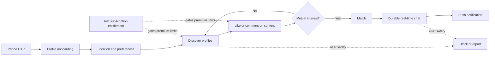
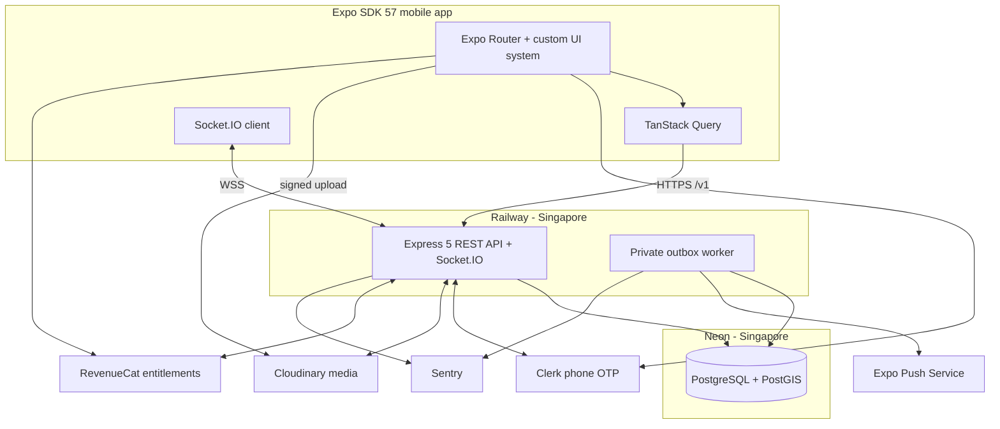

# ProDate

### A production-shaped, Hinge-inspired dating application built as an end-to-end mobile engineering project

`ProDate` is an independent portfolio and learning project that recreates the core mechanics of a modern dating application with original branding, interaction design, and implementation. The goal is not a public launch; the goal is to build the complete system as close to a real product as practical: phone verification, profile creation, geospatial discovery, item-specific likes and comments, mutual matches, durable real-time messaging, push notifications, safety controls, test-store subscriptions, observability, and repeatable deployment.

> **Project status:** the repository foundation, shared transport contracts, hardened API health surface, and Expo SDK 57 onboarding shell are implemented and verified. The full V0 product loop remains in development; features below are planned unless explicitly shown as implemented.

## Product preview

Verified screenshots will be added after each workflow runs on the physical iPhone test path. They will use fictional seed profiles and redact phone numbers, exact locations, tokens, and other private data. Concept mockups will never be presented as implemented product evidence.

The planned gallery will cover:

| Authentication    | Onboarding          | Discovery        | Engagement       |
| ----------------- | ------------------- | ---------------- | ---------------- |
| Phone OTP         | Profile and prompts | Profile card     | Like or comment  |
| Match             | Messaging           | Safety           | Subscription     |
| Match celebration | Durable chat        | Block and report | Test entitlement |

## What this project demonstrates

- A complete mobile journey from phone OTP through matching and messaging
- A custom, accessible Expo interface rather than a generic component-library skin
- Fully relational dating-domain modeling with PostgreSQL and PostGIS
- Privacy-aware proximity filtering without exposing exact coordinates
- Retry-safe mutations, canonical match creation, durable messages, and webhook idempotency
- Real-time delivery through Socket.IO with PostgreSQL as the source of truth
- Asynchronous push delivery through a transactional outbox and worker
- Mobile subscription entitlements through RevenueCat's test environment
- A beginner-readable physical-iPhone workflow that starts in Expo Go and graduates to an EAS development build
- Production-oriented validation, authorization, rate limiting, logging, error reporting, automated tests, and deployments

## Core user workflow



## Release scope

“V0” is deliberately a thin but complete product loop. Later versions deepen the product only after that loop is reliable.

| Area          | V0                                                                  | V1                                                       | V2                                                      |
| ------------- | ------------------------------------------------------------------- | -------------------------------------------------------- | ------------------------------------------------------- |
| Identity      | Clerk phone OTP, internal account, 18+ attestation                  | Account recovery and richer lifecycle controls           | Optional stronger age/identity assurance                |
| Profiles      | Attributes, prompts, photos, ordering, completeness                 | More prompt/media formats and profile editing depth      | Voice/video prompts and experiments                     |
| Discovery     | Distance and preference filtering, baseline ordering, pagination    | Richer filters, undo, improved candidate balancing       | Learned ranking, standouts, explainable recommendations |
| Engagement    | Item-specific likes/comments, passes, mutual match                  | Incoming-like improvements and richer match feedback     | Roses, boosts, and consumable mechanics                 |
| Messaging     | Persisted text messages, Socket.IO delivery, reconciliation         | Reactions, typing/read indicators, richer inbox controls | Voice notes and advanced conversation assistance        |
| Safety        | Block, unmatch, report, evidence preservation, privacy controls     | Moderation operations and proactive interaction nudges   | Verification signals and risk-assisted review           |
| Notifications | Match/message push with preferences and receipts                    | Granular notification settings and reminders             | Personalized notification timing                        |
| Monetization  | RevenueCat Test Store entitlement                                   | App Store / Play Billing sandbox products                | Multiple tiers and consumables                          |
| Operations    | Health checks, logs, Sentry, rate limits, backups/deploy discipline | Operational dashboards and stronger runbooks             | Scale testing and multi-replica realtime infrastructure |

Not in V0: an admin moderation dashboard, identity verification, advanced recommendation models, boosts or roses, voice/video prompts, voice/video calling, social login, general email/SMS messaging, multi-region infrastructure, Kubernetes, microservices, Elasticsearch, or a public App Store launch.

## Experience and visual direction

The interface will be original—not a traced or pixel-identical Hinge UI.

| Area          | Direction                                                                                                         |
| ------------- | ----------------------------------------------------------------------------------------------------------------- |
| Character     | Warm, editorial, calm, intentional, inclusive                                                                     |
| Palette       | Off-white canvas, white surfaces, near-black text, coral primary accent, deep-plum secondary accent               |
| Typography    | Manrope with a readable system-font fallback                                                                      |
| Shape         | Tactile cards, 16–24 px surface radii, restrained elevation, generous touch targets                               |
| Rhythm        | 8-point layout grid with optical 4-point adjustments                                                              |
| Motion        | Purposeful 180–260 ms transitions, restrained springs, contextual haptics                                         |
| Accessibility | Dynamic type, VoiceOver labels, WCAG AA contrast, reduced motion, 44-point minimum targets, non-color-only states |
| Theme         | Light V0 theme with semantic tokens ready for a future dark theme                                                 |

The initial internal component set includes `AppText`, `Button`, `IconButton`, `TextField`, `PhoneField`, `OtpField`, `Avatar`, `Badge`, `PhotoTile`, `PromptCard`, `ProfileCard`, `BottomSheet`, `ProgressBar`, `Screen`, `EmptyState`, `ErrorState`, `OfflineBanner`, `Toast`, and `Skeleton`.

## System architecture



The backend is a modular monolith deployed as two processes from one codebase: a public API/realtime service and a private worker. PostgreSQL is the only durable application datastore. External providers are isolated behind adapters so domain logic is not coupled to Clerk, Cloudinary, RevenueCat, Expo Push, or Sentry.

## Architecture decision register

| Decision          | Choice                                                                            | Why                                                                                  |
| ----------------- | --------------------------------------------------------------------------------- | ------------------------------------------------------------------------------------ |
| Mobile runtime    | [Expo SDK 57](https://expo.dev/changelog/sdk-57), React Native 0.86, React 19.2.3 | Current stable Expo line and supported by the current iOS Expo Go application        |
| Navigation        | Expo Router                                                                       | Expo-first routing, deep links, and typed route support                              |
| UI foundation     | React Native primitives, `StyleSheet`, typed tokens, internal components          | Distinctive product experience without a generic Material-style visual system        |
| API               | Express 5 REST under `/v1`                                                        | Explicit, versionable, testable mobile contracts                                     |
| Realtime          | Socket.IO                                                                         | Reconnect-friendly transport; durable state remains in PostgreSQL                    |
| Database          | Neon PostgreSQL with PostGIS in Singapore                                         | Relational integrity, transactions, and geospatial filtering near the backend region |
| Data access       | Drizzle ORM and committed Drizzle Kit migrations                                  | Type-safe relational access and auditable schema history                             |
| Geospatial access | `geography(Point, 4326)` plus reviewed parameterized SQL where required           | Correct distance semantics without forcing all queries outside the ORM               |
| Domain modeling   | Normalized relational tables; no JSONB domain documents                           | Explicit constraints, joins, uniqueness, and queryable relationships                 |
| Authentication    | Clerk custom phone OTP plus internal UUID users                                   | Provider handles verification; application retains domain identity ownership         |
| Media             | Signed Cloudinary uploads                                                         | The device uploads directly without receiving a provider secret                      |
| Async work        | PostgreSQL transactional outbox and private worker                                | Couples state changes and side-effect intent atomically                              |
| Subscriptions     | RevenueCat Test Store, then platform billing sandboxes                            | Production-shaped entitlement handling without collecting card details directly      |
| Deployment        | Railway API/worker and Neon database in Singapore                                 | Simple first deployment with Docker, WebSockets, private services, and nearby data   |
| Scale posture     | One API replica and no Redis in V0                                                | Avoids infrastructure without a demonstrated scaling need                            |

## Technology stack

Exact package versions are pinned in the workspace lockfile. Expo-native versions are checked against Expo SDK 57 with Expo CLI and Expo Doctor rather than inferred from semver alone.

| Layer              | Technologies                                                                                                                                                                                     |
| ------------------ | ------------------------------------------------------------------------------------------------------------------------------------------------------------------------------------------------ |
| Workspace          | Node.js 24 LTS, TypeScript 6 strict mode, pnpm 12 workspaces                                                                                                                                     |
| Mobile             | Expo 57, React Native 0.86, React 19.2.3, Expo Router                                                                                                                                            |
| Mobile UI          | React Native `StyleSheet`, Reanimated, Gesture Handler, Keyboard Controller, Expo Image/Image Picker/Image Manipulator, DateTimePicker, Haptics, Safe Area Context, Lucide React Native, Manrope |
| Mobile state/forms | TanStack Query, React Hook Form, Zod, React state first; Zustand only if a real cross-screen need appears                                                                                        |
| API                | Express 5, Zod, Helmet, CORS, rate limiting, Pino, generated OpenAPI 3.1 with a protected Scalar reference                                                                                       |
| Data               | PostgreSQL, PostGIS, Drizzle ORM, Drizzle Kit, `pg`, Neon                                                                                                                                        |
| Integrations       | Clerk, Cloudinary, Socket.IO, Expo Notifications/Push, RevenueCat, Sentry                                                                                                                        |
| Mobile tests       | Jest, `jest-expo`, React Native Testing Library, Maestro                                                                                                                                         |
| API tests          | Vitest, Supertest, Testcontainers with real PostGIS                                                                                                                                              |
| Delivery           | Docker, Railway, Neon, EAS Build/Update, GitHub Actions                                                                                                                                          |

Intentionally deferred: Redis, the Socket.IO Redis adapter, Kubernetes, microservices, Elasticsearch, a large third-party UI kit, and speculative global-state infrastructure.

## Domain and data model highlights

- Every user has an internal UUID. Clerk subject IDs are unique external references, not primary domain identifiers.
- Profile presentation is an ordered sequence of relational content items. Photo and prompt-answer tables specialize those items.
- A like references the exact profile content item that received the like or comment.
- A match stores a canonical low/high user pair protected by a unique constraint, preventing two concurrent likes from creating duplicate matches.
- A message carries a client-generated intent ID protected by a sender-scoped unique constraint, making mobile retries safe.
- Candidate and message lists use opaque cursor pagination rather than page numbers.
- Provider webhook event IDs are unique, and webhook payloads are normalized into typed relational fields.
- Latest location is stored as PostGIS geography. Exact coordinates are never returned to another user or included in logs.
- Domain transactions write outbox records atomically; the worker delivers push notifications and other external effects with retry and receipt handling.

## API and realtime contract

- REST is authoritative for bootstrap, profiles, discovery, likes, matches, history, safety actions, and reconciliation.
- Socket.IO delivers low-latency events but does not define durable truth.
- Every error uses one structured envelope with a machine code, safe message, optional validation details, and request ID.
- Boundary inputs, environment variables, webhooks, and third-party responses are validated with Zod.
- Retriable mutations use a client intent key whose payload is guarded by a database uniqueness constraint and request hash.
- List responses use stable opaque cursors.
- Reconnect flows fetch durable state so missed, duplicated, or out-of-order realtime events converge correctly.

Generated OpenAPI documentation will be exposed from the running API once endpoints exist; a separate public specification document is intentionally not kept in the repository.

## Safety, security, and privacy

- V0 requires an 18+ attestation but does not claim government-ID or selfie verification.
- Block and report are available from discovery and conversation contexts. Blocking removes mutual visibility and prevents new interaction.
- Reports preserve the minimum evidence needed for later review. V0 has no admin dashboard, so reporting must never imply an immediate human response that does not exist.
- Image uploads use constrained signed parameters, MIME/content validation, size limits, metadata removal, and derived delivery assets.
- Exact coordinates, phone numbers, session tokens, private message bodies, and provider secrets are excluded from logs and error telemetry.
- Clerk tokens are verified by the backend; authorization is evaluated against internal account and resource state on every protected operation.
- Rate limits are differentiated by authentication, discovery, engagement, messaging, media, and webhook risk.
- Provider webhook signatures are verified against the raw request body before parsing.
- Secrets remain in local environment files, EAS secret environments, Railway sealed variables, and provider dashboards—never in `EXPO_PUBLIC_*` variables or Git.
- Account deletion, retention, media deletion, and backup behavior will be testable workflows rather than documentation-only promises.
- The workspace uses one pinned pnpm version and one authoritative lockfile. Dependency lifecycle scripts are blocked by default and only narrowly approved after their exact source and version are reviewed.
- Every personal field has a stated purpose and retention rule; export and deletion cover provider assets, device tokens, caches, and the documented backup-expiry window rather than only the primary user row.

This is a production-shaped project, not an operating public dating service. Its safety model is deliberately honest about the absence of staffed moderation and identity verification in V0.

## Repository structure (implemented and planned)

```text
pro-date/
├── apps/
│   ├── mobile/        # Expo application
│   ├── api/           # Express HTTP and Socket.IO service
│   └── worker/        # Planned transactional-outbox consumers
├── packages/
│   ├── contracts/     # Shared Zod schemas and transport types
│   ├── database/      # Planned Drizzle schema, migrations, and repositories
│   ├── domain/        # Planned pure domain rules and state transitions
│   ├── observability/ # Planned logging, tracing, and redaction helpers
│   └── config/        # Planned extracted shared configuration
├── tests/             # Planned cross-service test suites
│   └── e2e/           # Planned Maestro flows and test fixtures
├── Dockerfile         # Planned deployment image
├── package.json
├── pnpm-workspace.yaml
└── README.md          # The only tracked project Markdown document
```

Private specifications, plans, goals, task lists, and detailed decision records live under the local, gitignored `.project-docs/` directory. This keeps all project work inside the workspace without publishing working notes to GitHub.

## Local development

The current prerequisites are:

- Node.js 24 LTS
- Corepack-managed pnpm
- An Expo account
- An iPhone running iOS 16.4 or later for the primary physical-device path
- Current Expo Go with SDK 57 support
- Docker for local PostGIS integration tests
- Provider development/test accounts as their integrations are introduced

Install and verify the implemented foundation from the repository root:

```bash
corepack enable
pnpm install
pnpm verify
```

Run the services in separate terminals:

```bash
pnpm dev:api
pnpm dev:mobile
```

The API defaults to `http://localhost:3000`; its liveness and readiness endpoints are `/health/live` and `/health/ready`. The mobile command starts Expo Router and prints the Expo Go QR code. Dependency stores and caches used during this project are kept inside the repository and ignored by Git.

Database migration and seed commands will be introduced with the PostGIS slice; they are intentionally not advertised before they exist.

## Physical iPhone: Expo Go first run

[Expo Go 57 is available on the iOS App Store](https://expo.dev/changelog/expo-go-57-login). The initial device workflow is:

1. Install or update Expo Go on the iPhone and confirm the phone runs iOS 16.4 or later.
2. Create an Expo account if needed and sign into that same account in both Expo Go and the terminal.
3. From the repository root, sign in and validate the project:

   ```bash
   pnpm --filter @pro-date/mobile exec expo login
   pnpm --filter @pro-date/mobile exec expo install --check
   pnpm doctor
   pnpm dev:mobile
   ```

4. Keep the Mac and iPhone on the same Wi-Fi network.
5. Scan the terminal QR code with the iPhone Camera application.
6. If the LAN cannot connect, stop Metro and use `pnpm --filter @pro-date/mobile exec expo start --tunnel`. Tunnel mode is slower but bypasses many local-network discovery problems.

Expo Go is appropriate for navigation, interface work, backend calls, location, and Clerk's custom JavaScript phone-OTP flow. It is not the final runtime:

- [Remote push notifications require a development build on SDK 53 and later](https://docs.expo.dev/push-notifications/faq/).
- RevenueCat and other custom native modules require a development build; Expo Go can only provide limited preview behavior.
- Native permission/configuration changes, native dependency updates, and app-entitlement changes require a rebuilt binary.

## Development, preview, and production builds

After the first end-to-end slice runs in Expo Go, daily development moves to an EAS development build:

```bash
npx expo install expo-dev-client
pnpm dlx eas-cli@24.10.0 login
pnpm dlx eas-cli@24.10.0 build:configure
pnpm dlx eas-cli@24.10.0 device:create
pnpm dlx eas-cli@24.10.0 build --platform ios --profile development
npx expo start --dev-client
```

An EAS cloud development build for a physical iPhone requires an active Apple Developer Program membership and registered device. A Mac can alternatively use `npx expo run:ios --device` with local Xcode signing, subject to Apple's free-signing limitations.

The build profiles are:

| Profile       | Purpose                                        |
| ------------- | ---------------------------------------------- |
| `development` | Native development client with developer tools |
| `preview`     | Production-shaped internal testing             |
| `production`  | Store-signed release candidate                 |

EAS Update is reserved for JavaScript and asset changes compatible with the installed runtime. Native dependency or configuration changes always produce a new build.

## Testing and quality gates

| Gate                 | Evidence required                                                                                                |
| -------------------- | ---------------------------------------------------------------------------------------------------------------- |
| Format and lint      | No repository-format or lint violations                                                                          |
| Type safety          | Strict TypeScript passes across all workspaces                                                                   |
| Domain tests         | Pure rules and state transitions are deterministic                                                               |
| Mobile tests         | Components are behavior- and accessibility-tested                                                                |
| API integration      | Routes are exercised through Supertest                                                                           |
| Database integration | Queries and constraints run against real PostGIS through Testcontainers                                          |
| Native flows         | Critical paths run through Maestro on a development/preview build                                                |
| Dependency health    | Expo Doctor and package compatibility checks pass                                                                |
| Migration safety     | Forward migrations pass on a fresh and representative database                                                   |
| Security             | Authorization, input boundaries, upload constraints, webhook verification, redaction, and rate limits are tested |
| Delivery             | Docker build and environment validation pass before deployment                                                   |

CI and coverage badges will be added only after real workflows produce those results.

Current foundation evidence:

- 29 automated tests pass across shared contracts, API integration behavior, bootstrap logic, and mobile component behavior.
- Strict TypeScript, repository formatting, generic lint rules, Expo React/React Hooks rules, and React Compiler lint rules pass.
- The dependency graph has no peer dependency issues.
- Expo Doctor passes all 21 checks, and Expo CLI reports that the installed packages match SDK 57.
- Metro produces a successful iOS Hermes export with only the three Manrope weights used by the interface.

## Deployment model

```text
Git push
├── Railway Singapore
│   ├── Public API + Socket.IO service
│   └── Private transactional-outbox worker
├── Neon Singapore
│   └── PostgreSQL + PostGIS
└── EAS
    ├── Development build
    ├── Preview/internal build
    ├── Production build
    └── Runtime-compatible JavaScript updates
```

- The API binds to Railway's injected port and exposes separate liveness and readiness endpoints.
- Runtime services use Neon's pooled connection; migrations use a direct connection.
- Migrations run once as a pre-deploy step and prevent release on failure.
- V0 uses one API replica. Redis is introduced only when horizontal Socket.IO scaling requires a cross-instance adapter.
- Railway's deployment health check is complemented by external uptime monitoring and worker-heartbeat alerting.
- Preview receives and verifies an update before the same compatible update is promoted to production.

## Current status

Last architecture verification: **4 October 2026**

| Milestone                              | Status                    |
| -------------------------------------- | ------------------------- |
| Product boundary and V0 journey        | Approved                  |
| Capability map                         | Approved                  |
| Core architecture and provider choices | Approved baseline         |
| Expo SDK/App Store compatibility       | Verified for SDK 57       |
| Exact dependency manifest              | Verified and locked       |
| Installed dependency lock              | Implemented               |
| Shared API contracts                   | Implemented and tested    |
| Express health/startup foundation      | Implemented and tested    |
| Mobile shell specification             | Approved                  |
| Repository scaffold                    | Implemented               |
| Expo welcome and phone-entry shell     | Implemented and tested    |
| Expo Doctor / iOS Hermes export        | Verified                  |
| First physical-device run              | Awaiting device test      |
| Live Clerk phone OTP                   | Next implementation slice |
| V0 vertical slice                      | Not started               |

The next milestone is to run the shell in Expo Go on the physical iPhone, capture the first verified screenshots, and then implement the Clerk phone-OTP slice without mixing placeholder authentication into the production path.

## Legal and intellectual-property note

This is an independent educational and portfolio project inspired by common interaction patterns in modern dating products. It is not affiliated with, endorsed by, or sponsored by Hinge or Match Group. It does not use copied source code, private APIs, proprietary assets, trademarks as product branding, or a pixel-identical interface. All demo profiles are fictional and all media must be owned, generated for the project, or appropriately licensed. Third-party product names remain the property of their respective owners.
